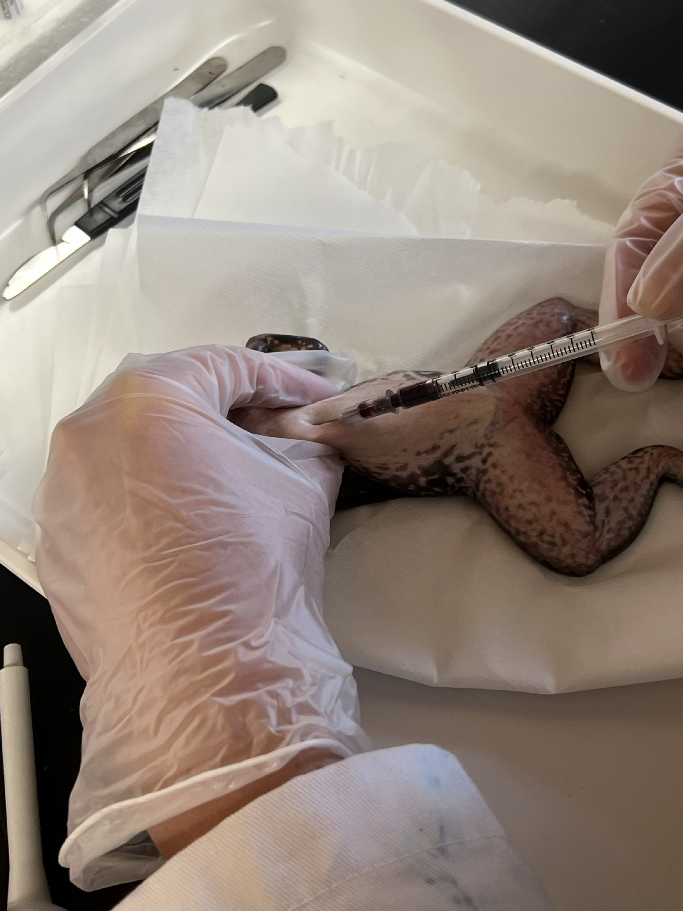

## Projects

### Project 1: How does temperature affect complement inhibition of pathogens? 

**Overview:**  
  Emerging infectious diseases are a major threat to global wildlife biodiversity (Jones et al., 2008). One mechanism by which hosts can mitigate the impacts of infectious diseases is through shifts in behavior that reduce pathogen growth or enhance host defenses. Behavioral fever is a shift in thermal preference (Tpref) during pathogen exposure (Kluger, 1979). In ectothermic organisms, exposure to pathogens can induce these shifts in Tpref toward warmer temperatures (Kluger, 1979; Rakus et al., 2017). By elevating body temperature, hosts can enhance metabolic and immune processes, potentially improving their ability to resist or clear infections (Rakus et al., 2017).
  Amphibians, as ectotherms, have been observed to exhibit behavioral fever in response to infection, including infections by Ranavirus and the fungal pathogen Batrachochytrium dendrobatidis (Sauer et al., 2019; Richards-Zawacki, 2010). The individuals that had an increase in Tpref experience reduced pathogen loads and increased survival (Sauer et al., 2019; Richards-Zawacki, 2010). However, the effects of elevated host temperature on amphibian immune function are complex and not well understood. 
  The amphibian immune system consists of both innate and adaptive components (Rollins-Smith, 2017). The innate immune system is a first line of defense against invading microorganisms and includes mechanisms such as antimicrobial peptides, skin microbiota antifungal metabolites, and complement system (Rollins-Smith, 2017; Walke and Belden, 2016; Rollins-Smith, 2009). While some aspects of amphibian innate immunity have been well studied, components like the complement system remain understudied despite its potential importance in pathogen defense. The complement system is a proteolytic cascade composed of over 30 proteins that function to recognize and eliminate pathogens through multiple activation pathways (Sarma and Ward, 2011).
  Investigating how temperature influences these immune mechanisms is critical for understanding host–pathogen dynamics. By exposing amphibian serum to different temperatures, we can directly assess how temperature affects innate immune function, including serum complement-mediated microbial inhibition. To evaluate this, I propose using two microbial systems. The first is chytridiomycosis, a fungal disease caused by Batrachochytrium dendrobatidis, which has been implicated in declines of over 500 amphibian species and numerous extinctions (Scheele et al., 2019). The second is Pseudomonas fluorescens, a bacterium associated with amphibian skin microbiota that can interact with host immune factors, such as serum-mediated defenses (Culp et al., 2007; Pacheco et al., 2024). I hypothesize that exposure of amphibian serum to elevated temperatures will enhance immune activity, resulting in decreased microbial growth. 

**Methods:**  
- Bacterial Killing Assay (BKA)
- MTT Assay  
  

**Goal:**  
I am trying to show that as temperature rises, complement inhibition will increase. Indicating that behavioral fever in amphibians can increase a complement response to better fight off infection.

---

### Project 2: Complement Activation In Vivo

**Overview:**  
The amphibian immune system is comprised of innate and adaptive components. The innate immune 
system is a first line of defense against microorganisms. While some aspects of the innate system have been 
investigated in the chytridiomycosis system (e.g., skin secretions containing anti-microbial peptides or 
symbiotic skin bacteria with antifungal metabolites), other key features (e.g., the complement system) are 
less understood but thought to be important determinants of host resistance to Bd. The complement system 
involves an enzyme cascade of approximately 50 proteins that, when activated, play a key role in 
immunity. Namely, it “complements” other immune responses and functionally links the initial innate 
response and the activation of the more robust adaptive system. For this project I plan to do an inoculation study to look at complement activation during infection. This project will be carried out across multiple disciplines, to get a better understanding of protein activation during infection.   

**Methods:**  
- BKA
- MTT assay
- qPCR
- Mass Spectrometry

**Goal:**  
This project aims to get a better idea of amphibian immune responses to *Bd* infection. I can then compare across multiple species to understand why there is differential susceptibility across amphibian phylogeny. 