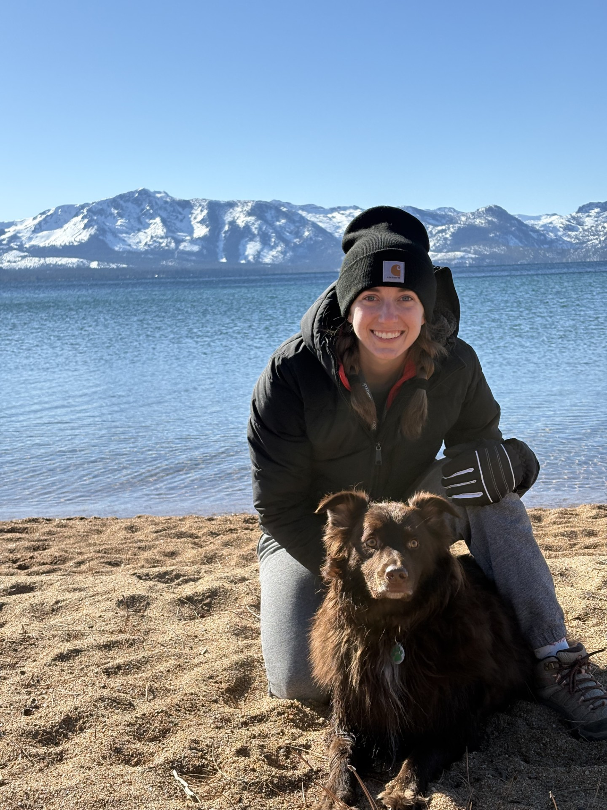
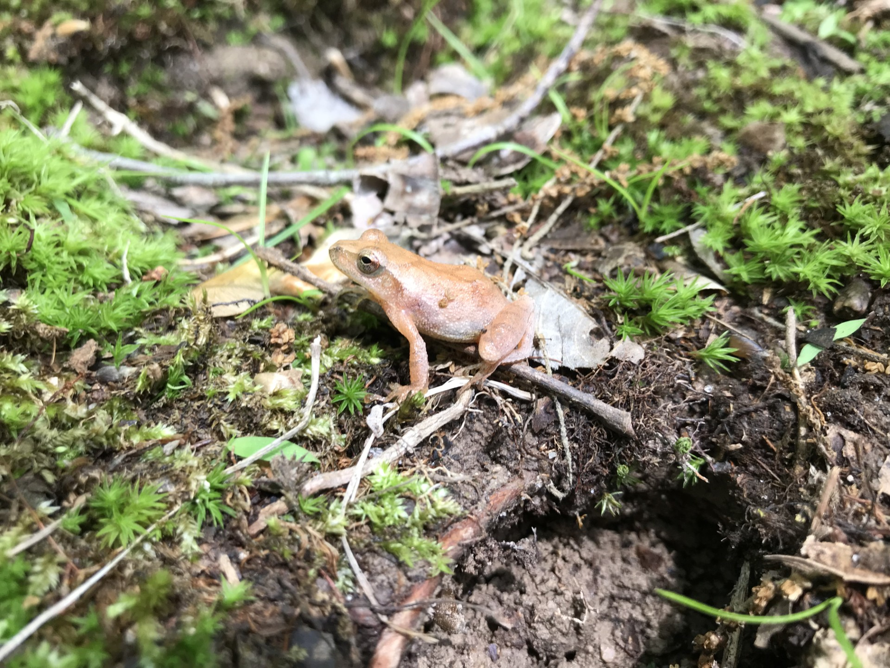
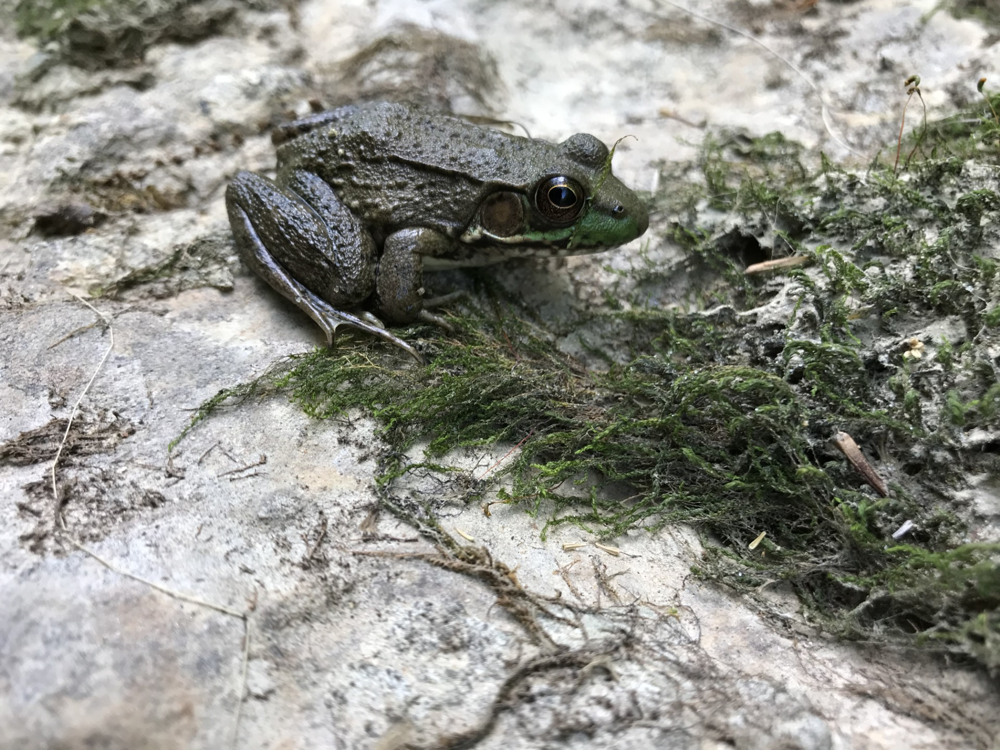
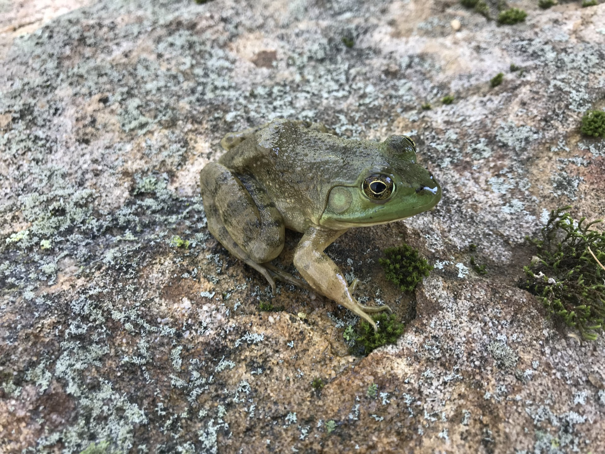
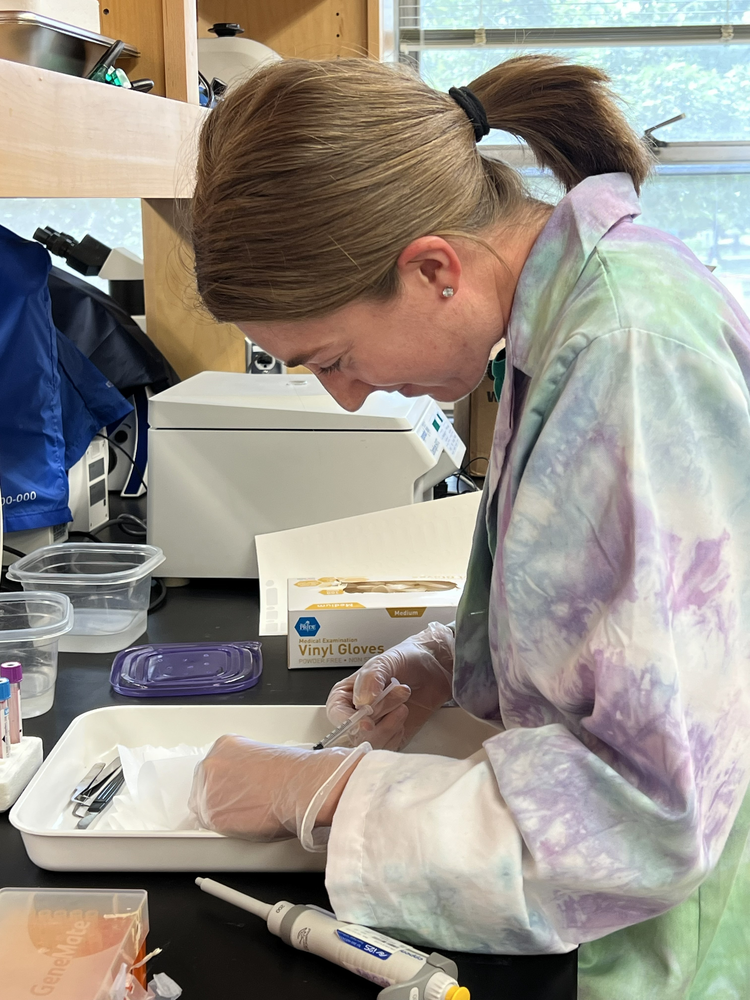

## About this website

This website is made to show research projects by Sidney Goedeker at the University of Nevada, Reno. For peers and collaborators, navigate to research tab, and on the "Current Research" tab will be updated research projects. On the "Past Research" tab will be past projects and publication under the appropiate projects.    

---

